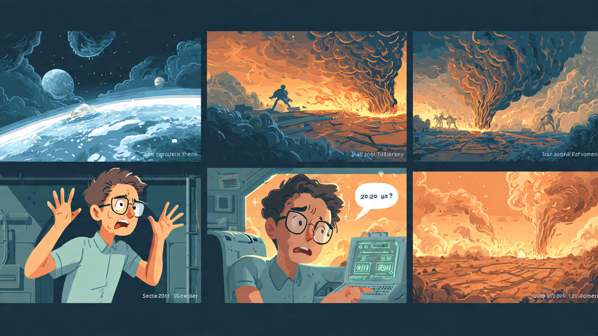

**ACT 1 - PROLOGUE: THE BURNED PLANET (0:00-0:45)**

**Scene 1 (0:00-0:25) - Void**

- Visual: Deep blue, white cutout cracked Earth.
- Kai VO: "2147. We didn't lose to climate. We lost to bad choices."
- Camera pushes into crack.

**Scene 2 (0:25-0:45) - The Warp**

- Inside: Kai in time-pod, pulls lever.
- KAI : "I'm going back to learn _why_ we choose wrong."
- Portal flashes - he disappears.

**ACT 2 - THE LIBRARY (0:45-2:00) _your new version_**

**Scene 3 (0:45-1:05) - Arrival**

- Kai crashes _into_ an old university library in 2025
- A thick book drops on his head. Title in hand-lettering: **"How to Understand Whatever Reason"**

**Scene 4 (1:05-1:30) - The Book**

- He opens it, pages flip in cutout style:
  - Page 1: **"Policy Analysis"** - _find what people fundamentally want, not what they say_
  - Page 2: **"Policy Design"** - _test "what if" before you act_
  - Page 3: **"Tool: Structural Estimation"** - _Static model (one choice) / Dynamic utility model (choices over time)_
- VO: "So economists don't guess. They build models of hidden wants."

**Scene 5 (1:30-1:50) - Reading Montage**

- Kai read that book beside the table. Window behind him loops fast: daylight → night → daylight → night. Pages turn. Shows hours passing.
- he's learning the framework.

**Scene 6 (1:50-2:00) - The Bump**

- He stands, walks out door with book under arm, bumps into a young woman.
- Kai: "Mara?!"
- She steps back, scared: "Sorry- do I know you?"
- Kai freezes (thought): "In 2025 she doesn't love me yet. What did I do wrong? I need to study what make she love me again , like finding hidden preferences that I read."

ACT 3 - DATING LAB: LEARNING BY WATCHING (2:00-3:20) - NEW, FUNNY

Scene 7 (2:00-2:20) - Back Inside Embarrassed, Kai ducks back into library, opens laptop. He types "how humans match"

Scene 8 : KAI opens SoulMatch dating app. For comic relief, a pop-up ad: "PawMatch - find love for your dog" - he clicks it by accident.

Scene 9 : (2:20-2:50) Visual: split screen - left: humans swiping, right: a bulldog in a bowtie swiping on poodles.

Scene 10 : Kai chuckles. Thought bubbles appear around his head (we SEE his mapping):

Bubble 2: "Static model" → arrow to screen: U = X\\beta + \\epsilon

Bubble 3: "Dynamic" → arrow to screen: "2 weeks later..."

Scene x (2:50-3:20) - Zoom into our example (through KAI perspective looking in the laptop) (visual will be like KAI thinking in his head and try to map what he read)

\[This part should put our code example how the static utility and dynamic utility help understand user preferences of picking their mate, this will help KAI to understand "Why" LENA love him and "What if" that thing change what will happen\] 🡪 \[required\] but need to transform the finding into animation format first.

Then eventually, from the result KAI will know what to do next and try to approach to lena (with his new policy) and try to make her fall in love with himself again.

ACT 4 – THE APPROACH: OPTIMIZING THE WRONG THING (3:20-4:15)

**Scene 11 (3:20-3:40) - Kai's "Policy"**

- Visual: Kai in coffee shop, Lena at a table across the room.
- Kai has a notebook filled with data analysis: "Income = positive signal", "Kindness score = beta coefficient", "Time investment = dynamic utility over 2 weeks".
- Kai walks over with calculated confidence.
- **Kai:** "Hi Lena. I've analyzed our compatibility metrics. If I increase [quality time] by 30%, your utility function should optimize toward [relationship]=1."
- Lena looks confused, then uncomfortable.
- **Lena:** "You... analyzed me?"
- Kai (proudly): "Structural estimation. I found your hidden preferences."

**Scene 12 (3:40-4:00) - The Challenge**

- Visual: Lena stands, crossed arms. The background shifts from coffee shop to a thought-bubble space (dreamlike).
- **Lena:** "Wait. Did you understand the model, or did you just find a way to manipulate my choices?"
- Kai stops mid-sentence. Silence.
- **Lena:** "The model doesn't tell you what to do. It tells you *why* people decide. That's... different."
- **Kai (realization, VO):** "Oh."

**Scene 13 (4:00-4:15) - The Real Lesson**

- Visual: Kai sits alone, the notebook falls from his hands.
- Cutout animation: pages flip backward, showing all the equations and graphs dissolving.
- **Kai (VO, slowly):** "I thought I was learning how to win. But the model doesn't optimize choices. It *opens the black box* of choice. It asks: why do people decide the way they do?"
- Screen fades to white.
- **Kai (VO):** "And once you understand *why* they choose, you can ask: what if the world changed?"

---

## ACT 5 – THE LEAP: FROM LOVE TO STAKES (4:15-5:45)

**Scene 14 (4:15-4:35) - The Realization**

- Visual: Kai back in the library. He closes the Speed Dating notebook. Looks at a shelf with books about climate, energy, policy.
- **Kai (VO):** "In dating, I observed Lena's choice: yes or no. But I never knew her full preference structure. That gap — that's where structural estimation lives."
- He pulls down a book: "Energy Transitions and Emissions Policy".
- **Kai (VO):** "But what if the stakes weren't one person's heart?"

**Scene 15 (4:35-5:00) - Visual Transition: Split Screen**

- Left side: Dating profile with "Yes/No" swipe.
- Right side: A map of Earth with countries colored by emissions status.
- Both have the same visual motif: a **black box with a question mark**.
- **Kai (VO):** "In dating, we ask: does person A choose person B? Yes or no."
- Both images pulse.
- **Kai (VO):** "In climate policy, we ask: does a country choose green transition? Does it invest in renewables? Does it decarbonize?"
- The images merge into one.

**Scene 16 (5:00-5:20) - The Connection**

- Visual: Kai opens the Energy & Climate notebook on the laptop.
- Code appears on screen: `TARGET = "green_transition"`. Y = 1 (country transitions), Y = 0 (country does not).
- **Kai (VO):** "Same structure. Different stakes. Same structural estimation logic."
- **Kai (reading, then looking up):** "We do not directly observe *why* a country chooses its energy path. We only observe the choice: transition or not. So we estimate the hidden utility."

**Scene 17 (5:20-5:45) - What's Inside the Black Box?**

- Visual: Black box opens like a chest.
- Variables tumble out in cutout style: "GDP per capita", "Energy intensity", "Coal dependence", "Carbon intensity", "Population".
- **Kai (VO):** "Just like in dating — attractiveness, age, shared interests — in climate, the hidden preferences are economic development, energy efficiency, fossil fuel lock-in, and scale."
- **Kai (VO):** "Structural estimation estimates the weight of each of these hidden factors."

---

## ACT 6 – THE MODEL: STRUCTURAL ESTIMATION EXPLAINED (5:45-7:00)

**Scene 18 (5:45-6:15) - The Binary Logit**

- Visual: Abstract mathematical space. A curved S-shaped line (logit curve) appears on screen.
- On one side: "Not ready to transition" (Y=0). On the other: "Ready to transition" (Y=1).
- The x-axis is labeled "Structural Index" — a combination of all hidden factors.
- **Kai (VO):** "Here's the core: we use a logit model. It's simple math, but powerful."
- **Kai (as educator, calmly):** "The model estimates the threshold. Above this line, the country transitions. Below it, it doesn't."
- A country data point (e.g., dots representing different nations) scatter across the curve.
- **Kai (VO):** "Each country-year has a structural index based on its income, energy efficiency, coal dependence, and other factors."

**Scene 19 (6:15-6:45) - The Coefficients: What Matters?**

- Visual: Notebook output appears, showing logit model results in a clean, animated format.
- Bar chart rises: 
  - "GDP per capita": **POSITIVE** (coefficient = 0.55, p < 0.0001) — richer countries more likely to transition.
  - "Energy intensity": **POSITIVE** (coefficient = 2.03, p = 0.0007) — countries that consume energy inefficiently are more motivated to transition.
  - "Coal dependence": **NEGATIVE** (coefficient ≈ -1.5) — coal-dependent countries face structural barriers.
- **Kai (VO):** "Some factors push countries *toward* transition. Others create friction."
- **Kai (VO):** "This is the hidden utility structure. And now that we've estimated it, we ask the crucial question..."

**Scene 20 (6:45-7:00) - The Power**

- Visual: The screen zooms out. All the countries and factors are still visible, but now there is a large question hanging over the scene.
- **Kai (VO):** "What... if?"

---

## ACT 7 – THE COUNTERFACTUAL: POWER OF "WHAT IF?" (7:00-8:30)

**Scene 21 (7:00-7:20) - The First Scenario**

- Visual: The logit curve reappears. A country (e.g., India) sits below the threshold, non-transitioning.
- **Kai (VO):** "Take a coal-dependent country. In 2020, it did not make a green transition. Structural estimation helps us understand *why*."
- A lever appears on screen labeled "Carbon Intensity". Kai's hand (animated) pulls it down.
- As it moves, the country's structural index increases (the curve shifts or the point moves right).
- **Kai (VO):** "What if carbon intensity fell by 20%? What if clean technology became cheaper and more efficient?"
- The dot crosses the threshold. The country is now in the "transition" region.
- **Kai (VO):** "With the model, we can simulate that world and see what might change."

**Scene 22 (7:20-7:50) - Multiple Counterfactuals**

- Visual: Split screen with 4 scenarios:
  1. **Energy Intensity -30%** (improved efficiency) → more countries transition.
  2. **Coal Dependence -50%** (less reliance on coal) → threshold moves left, transition becomes easier.
  3. **GDP +20% per capita** (development) → countries move rightward, more likely to transition.
  4. **All three together** → widespread transition wave.
- **Kai (VO):** "Separately, each change is a lever. Together, they paint a picture of policy."
- Graphs appear showing: baseline transition rate (≈18%), vs. counterfactual scenarios (maybe 35-50%).
- **Kai (VO):** "If we make clean energy cheaper, improve energy efficiency, and couple it with economic development, the transition accelerates."

**Scene 23 (7:50-8:10) - Why This Matters**

- Visual: Kai looks directly at camera (breaks the fourth wall briefly).
- **Kai:** "This is the true power of structural estimation. We don't just predict. We understand *why* decisions happen, and we simulate *what if* they change."
- **Kai:** "In dating, this might help you understand why someone says yes or no. But in climate policy..."
- The screen shifts to show a real satellite image of Earth.
- **Kai (VO, more serious now):** "...this helps us understand how energy systems will evolve. How countries will choose. And how policy can nudge those choices."

**Scene 24 (8:10-8:30) - The Final Message**

- Visual: Kai stands outside the library, looking at the Earth (a large cutout planet in the sky).
- The camera pans to show multiple scenes in the background:
  - Countries transitioning to renewable energy
  - A city powered by solar and wind
  - The planet healing (polar ice refreezing, forests growing).
- **Kai (VO, reflective):** "I went back in time to learn why we choose wrong. But now I understand: the problem is not that our choices are irrational."
- **Kai (VO):** "The problem is that we did not understand the hidden trade-offs. We did not ask 'what if?' before it was too late."
- **Kai (VO, hopeful):** "Structural estimation is a tool to open that conversation. To reveal the hidden logic of choice. And to simulate a better path forward."
- The sun sets on the planet, casting long shadows.
- **Final message appears on screen:**
  - "Structural Estimation: Understanding Decisions, Simulating Futures."

---

## ACT 8 – CREDITS & METHODOLOGY NOTE (8:30-8:45)

**Scene 25 (8:30-8:45) - Methodology & Assets**

- Visual: Smooth scroll through key notebooks and datasets used.
- **Text on screen:**
  - "Built on: Speed Dating Dataset (Fiore et al., 2010)"
  - "Energy & Climate: Our World in Data (OWID) CO₂ Dataset"
  - "Model: Binary Logit Structural Estimation (Stata/Python)"
  - "Counterfactual simulations: Post-estimation predictions"
- **Voice (narrator, not Kai):** "This narrative is a simplified, educational illustration of structural estimation. It is not a complete econometric analysis, but a conceptual introduction to the method."
- Credits roll with music fading.

---

### REFERENCE TO NOTEBOOK RESULTS

- **Logit Model Output:** From `Energy_Climate_Structural_Estimation.ipynb` Cell 35  
  - GDP per capita coefficient: **+0.5488** (p < 0.0001, significant)  
  - Energy intensity coefficient: **+2.0320** (p = 0.0007, significant)  
  - Coal dependence: significant negative barrier  
  - Pseudo-R²: 0.0244 (low, but expected for country-level aggregate data)  

- **Target Variable:** `green_transition` (binary)  
  - Data: ~7,630 country-year observations  
  - Transition rate (baseline): **17.8%**  

- **Counterfactual Framework:** Ready for implementation in notebook (Cell 37+)  
  - Can simulate scenarios: carbon intensity ↓, energy efficiency ↑, coal dependence ↓  

